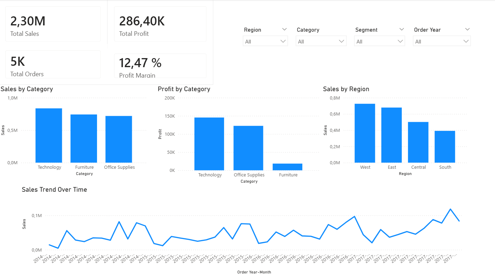

# 📊 Sales Data Analysis — End-to-End EDA & Business Intelligence

> **Business problem:** A retail company is losing profitability despite growing sales volume. This project identifies the root cause and quantifies the financial impact using Python and Power BI.

---

## 🎯 Key Business Finding

> A segment of **300 transactions** (only 0.74% of total orders) with **80% discounts** generated **$30,539 in losses** — representing a pricing strategy that actively destroys profitability.  
> **Recommendation:** Cap maximum discount at 30–40% to protect margins without losing volume.

---

## 📈 Power BI Dashboard



**Dashboard highlights:**
- **$2.30M** Total Sales | **$286.4K** Total Profit | **12.47%** Profit Margin
- Technology is the top category by both sales and profit
- Furniture shows the lowest profit margin — a key area for pricing review
- West and East regions drive the majority of revenue
- Sales trend shows consistent growth from 2014 to 2017

---

## 🛠️ Tools & Technologies

| Area | Tools |
|------|-------|
| Data Analysis | Python — pandas, numpy |
| Visualization | matplotlib, seaborn |
| Business Intelligence | Power BI Desktop |
| Data Source | Superstore Sales dataset (CSV) |
| Version Control | Git & GitHub |
| Environment | Jupyter Notebook (VS Code) |

---

## 🗂️ Project Structure

```
sales-data-analysis/
│
├── assets/
│   └── dashboard.png          # Power BI dashboard screenshot
├── data/
│   └── Superstore.csv         # Raw dataset
├── notebooks/
│   └── sales_eda.ipynb        # Full EDA notebook
├── .gitignore
├── README.md
└── requirements.txt
```

---

## 🔍 Analysis Workflow

### 1. Data Loading & Validation
- Loaded 9,994 rows × 21 columns with encoding handling (`windows-1252`)
- **No missing values or duplicate records** found — dataset was clean and analysis-ready

### 2. Exploratory Data Analysis (EDA)

**Categorical findings:**
- West region leads with 3,203 transactions; South is the smallest market (1,620)
- Consumer segment represents ~52% of all orders
- Standard Class shipping dominates — customers prioritize cost over speed

**Numerical findings:**
- Mean sales per transaction: ~$229 | Max: ~$22,638 (highly right-skewed)
- Mean profit per transaction: ~$28 | Min: ~-$6,599 (significant loss outliers)
- Discounts reach up to 80%, with measurable negative impact on profit

### 3. High-Discount Impact Analysis

```python
# Transactions with 80% discount
high_discount = df[df['Discount'] == 0.8]

# Result:
# Transactions:     300
# % of total:       0.74%
# Total Sales:      $16,963
# Total Profit:    -$30,539
```

**Insight:** 300 transactions generate $16K in sales but **$30K in losses** — a clear pricing policy issue.

### 4. Visualization & Dashboard
- Boxplots and histograms to detect outliers and distribution skew
- Logarithmic scaling to handle extreme values
- Power BI dashboard for interactive KPI analysis by category, region, segment, and time

---

## 📌 Summary of Business Insights

| Finding | Impact |
|---------|--------|
| High discounts (80%) destroy profit | -$30,539 from 300 transactions |
| Furniture category underperforms | Lowest profit margin across categories |
| West & East regions drive most revenue | South is an underserved growth opportunity |
| Sales growing year-over-year (2014–2017) | Positive trend, but profitability must improve |

---

## 🚀 Skills Demonstrated

- End-to-end data analysis pipeline (ETL → EDA → Insights → Dashboard)
- Identifying actionable business insights from raw data
- Communicating findings with business-oriented language
- Building interactive dashboards in Power BI
- Working with real-world messy datasets

---

*Dataset: [Superstore Sales (Kaggle)](https://www.kaggle.com/datasets/vivek468/superstore-dataset-final)*
